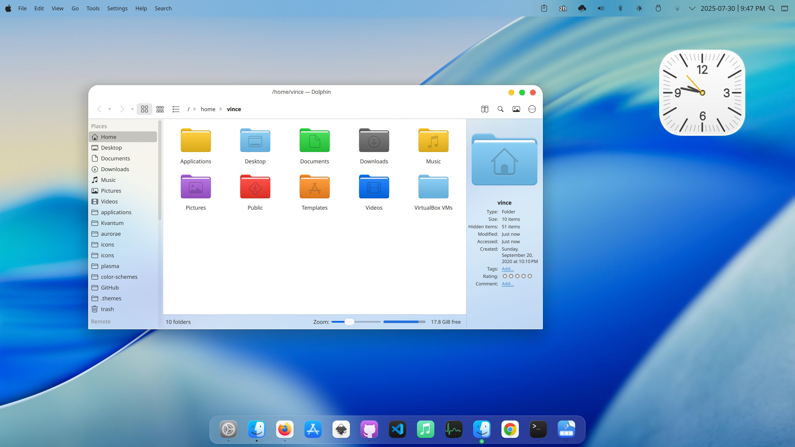
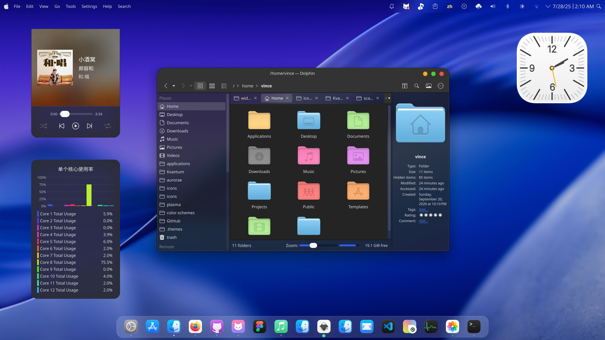

 MacTahoe KDE Theme
======

MacTahoe kde is a MacOS Tahoe like theme for KDE Plasma desktop.

In this repository you'll find:

- Aurorae Theme
- Kvantum Theme
- Wallpaper Theme
- Plasma Color Scheme
- Plasma Desktop Theme
- Plasma Global Theme

## Installation

```sh
./install.sh
```

## Recommendations
- For gtk app blur Effect you can use this extension [kwin-effects-forceblur](https://github.com/taj-ny/kwin-effects-forceblur).

  Go to `System Sttings` > `Window Management` > `Desktop Effects` > `Better Blur` turn it on

  Open `Better Blur` Configure window > `Force blur` active `Blur all except matching`

- For better looking please use this pack with [Kvantum engine](https://github.com/tsujan/Kvantum/blob/master/Kvantum/INSTALL.md#distributions).

  Run `kvantummanager` to choose and apply **MacTahoe** theme.

- Install [MacTahoe icon theme](https://github.com/vinceliuice/MacTahoe-icon-theme) for a more consistent and beautiful experience.

- Install [MacTahoe cursors theme](https://github.com/vinceliuice/MacTahoe-icon-theme/tree/main/cursors) for a more consistent and beautiful experience.

## Donate

If you like my project, you can donate at:

<span class="paypal"><a href="https://www.paypal.me/vinceliuice" title="Donate to this project using Paypal"></a></span>

## License

GNU GPL v3

## preview





